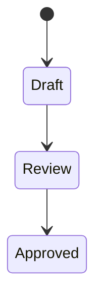

# Markdown Marker Specification

Use this reference when authoring or reviewing Markdown that will later be published to Feishu and converted into rich blocks.

## General Syntax

Use fenced container markers:

```markdown
:::kind key="value" key2="value"
content
:::
```

Rules:

- Start marker must begin at the start of a line.
- End marker is exactly `:::` on its own line.
- Attribute values must use double quotes.
- Keep marker content valid Markdown where possible.
- Do not nest custom markers unless the post-processing implementation explicitly supports it.

## Callout Blocks

Use for content that should become Feishu highlight/callout blocks.

```markdown
:::callout type="warning" title="上线风险"
这里写需要重点提醒的内容。
:::
```

Allowed `type` values:

- `info`: neutral explanation or context.
- `success`: conclusion, recommendation, accepted direction.
- `warning`: risk, tradeoff, operational caution.
- `danger`: blocker, severe risk, decision that needs escalation.
- `note`: supplementary detail.

Authoring rules:

- Keep callouts short. If the content has multiple subsections, use normal headings instead.
- Do not use callouts for decoration.
- Preserve the same text in Markdown; the marker only describes Feishu rendering.

## Mermaid Blocks

Use for diagrams that must become Feishu text drawing/Mermaid blocks.

````markdown
:::mermaid title="状态流转"

:::
````

Rules:

- Wrap Mermaid source in a normal fenced `mermaid` block inside the marker.
- Prefer `flowchart`, `sequenceDiagram`, `stateDiagram-v2`, `classDiagram`, or `timeline`.
- Keep labels concise so the diagram remains readable in Feishu.
- If Feishu import turns this into a code block, post-processing must replace it with a Feishu text drawing block.

## Decision Blocks

Use for explicit design decisions.

```markdown
:::decision title="缓存策略" status="accepted"
我们选择按用户维度缓存 10 分钟，因为读放大高于数据实时性要求。
:::
```

Allowed `status` values: `proposed`, `accepted`, `rejected`, `superseded`.

Recommended content:

- Decision.
- Reason.
- Consequence or follow-up.

In Feishu, convert to a callout/highlight block unless the target team has a stronger decision-record template.

## Risk Blocks

Use for risks and mitigations.

```markdown
:::risk level="high" owner="平台组"
风险：迁移期间双写状态可能不一致。

缓解：增加对账任务，发布前跑全量校验。
:::
```

Allowed `level` values: `low`, `medium`, `high`, `critical`.

In Feishu, convert to a warning/danger callout depending on severity.

## TODO Blocks

Use for unresolved follow-up items that should remain visible after publishing.

```markdown
:::todo owner="Alice" due="2026-05-30"
补充压测数据和容量估算。
:::
```

Rules:

- Use only when the published document should expose the open item.
- If the TODO is only for drafting, use an HTML comment instead: `<!-- TODO: ... -->`.

## Compatibility Fallback

The Markdown should still be understandable if markers are not converted. A reader should be able to infer the meaning from `kind`, attributes, and body text.
